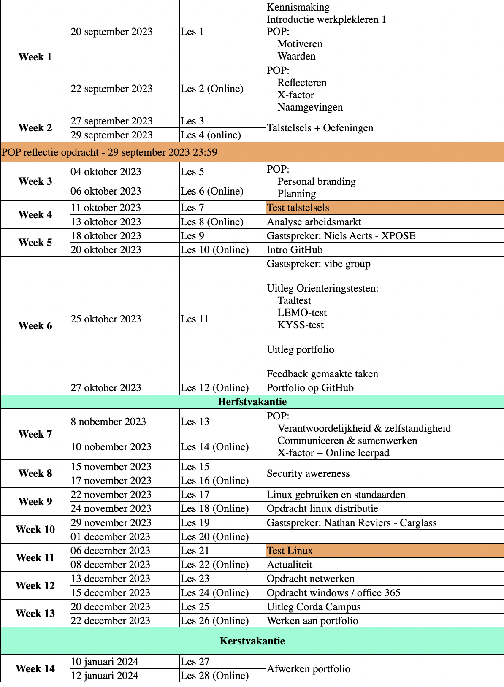

# Logboek werkplekleren

## Logboek WPL 1
**Het doel van WPL1 was oriëntering en kennismaken met het werkveld.**

Hiervoor hebben we opdrachten gedaan om het werkveld te verkenning, stilgestaan bij persoonlijke
kwaliteiten en ontwikkeling, gastcolleges gevolgd en kleine technische opdrachten uitgevoerd.

Hieronder kunt u de planning terugvinden van heel werkplekleren 1, dit wordt gegeven over een periode van 14 weken (sept-jan 23/24).

## Logboek WPL 2

## Logboek WPL 3

## Logboek WPL4
