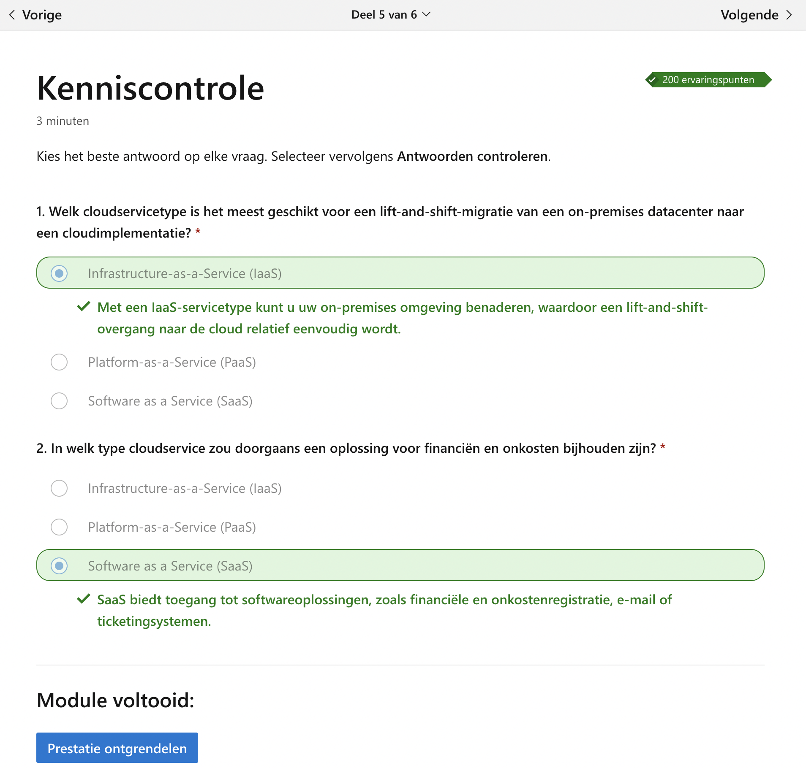

# Opdrachten

## Opdrachten WPL 1
### POP reflectieopdracht

### POP opdracht planning

### Carièrekompas

### Taal-, KYSS- & Lemo-test

### Opdracht actualiteit
### Is Artificiële Intelligentie een bedreiging voor ontwikkelaars of andere ICT-gerelateerde jobs? ###

- Leg eerst uit wat de stelling betekent. Leg eventuele nieuwe termen uit.
  > Het suggereert dat AI mogelijk een bedreiging vormt voor ICT-gerelateerde banen. Dit wil echter zeggen dat er jobs/taken zullen zijn die overgenomen kunnen worden door
  > AI, dit kan o.a. zorgen voor automatisering van bepaalde systemen en/of taken.
   
- Zoek enkele artikels / video's / ... op over het onderwerp en neem ze door, zodat je je mening nog beter kan vormen en/of je mening kan onderbouwen. Noteer de links naar de sites die je hebt geraadpleegd om je mening te vormen.
  > geeft urls die je mening onderbouwen
  >
- Ben je het ermee eens of niet en waarom? Geef kritisch je mening en argumenteer dit uitgebreid. Geef ook voorbeelden om je standpunt 
  duidelijk te maken. 
  > Ik ben er zeker mee eens dat AI wel delen van ICT-gerelateerde jobs zal overnemen in de toekomst.  
  > Hieronder enkele voorbeelden
  >  1. Automatisering van herhalende/ gemakelijke taken van de mens overnemen zodat wij op andere taken kunnen focussen. 
  >  2. AI kan grote hoeveelheden gegevens analyseren en verwerken, waardoor het ideaal is om inzichten te verkrijgen voordat er beslissingen worden genomen
  >  3. Efficiënter
  >  4. Verbeterde klanttevredenheid, omdat AI-chatbots en virtuele assistenten  een gepersonaliseerde en efficiënte klantenservice kunnen bieden 

### Microsoft learn
We kregen als opdracht om een traject te maken op microsoft learn, aangezien ik nog niet 100% weet welke richting ik specifiek uit wil gaan ben ik van plan verschillende trajecten te voltooien.

Laten we eerst starten met een kort traject waarin we de verschillen leren tussen cloud-services. Ik heb het namelijk over IaaS, PaaS en SaaS. Na de uitleg van de verschillende services volgde er een kleine toets van 2 vragen.

  
  

## Opdrachten WPL 3

## Opdrachten WPL 4
